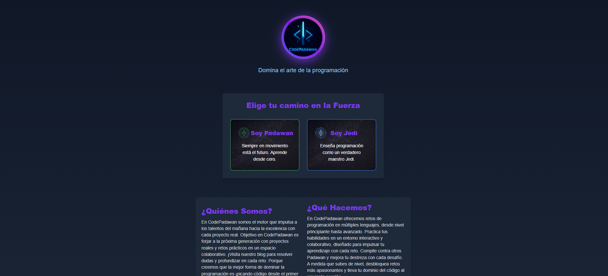
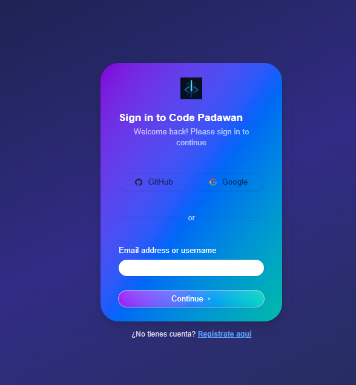
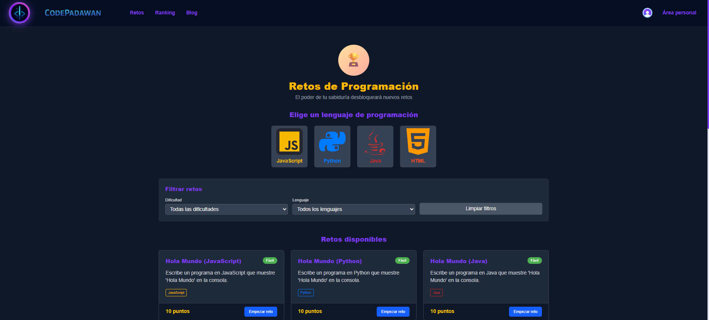

# Code Padawan 🌟

Code Padawan es una plataforma educativa diseñada para conectar a Padawans (aprendices que buscan aprender a programar) con Jedis (expertos con conocimientos avanzados) en un entorno colaborativo. Nuestra misión es fomentar el aprendizaje y la retroalimentación entre usuarios para ampliar sus habilidades en programación a través de retos, rankings, blogs y herramientas interactivas. 🚀

## Características Principales ✨

### 1. Retos de Programación 🧩
- Los Padawans pueden practicar con una variedad de retos en diferentes lenguajes de programación. 💻
- Completa retos para ganar puntos que desbloquean nuevas rutas de aprendizaje y ejercicios avanzados. 🔓
- Retos diseñados para todos los niveles, desde principiante hasta avanzado. 📈

### 2. Ranking y Logros 🏆
- Un ranking global muestra a los Padawans con más puntos acumulados. 📊
- Gana logros únicos al alcanzar hitos importantes en tus retos. 🎖️

### 3. Blog Colaborativo 📝
Espacio donde Padawans y Jedis pueden:
- Publicar artículos sobre programación. ✍️
- Resolver dudas en diferentes lenguajes. ❓
- Compartir conocimientos y mejores prácticas. 🤝

### 4. Área Personal 🧑‍💻
- Dashboard personalizado según tu rol (Padawan o Jedi) con estadísticas detalladas. 📈
- Playground interactivo: un entorno con consolas para probar código en cualquier lenguaje. 🛠️
- Sección de logros: visualiza tus logros obtenidos en la plataforma. 🏅
- Acerca de los desarrolladores: conoce al equipo detrás de Code Padawan. 👨‍💻👩‍💻

## Capturas de Pantalla 📸

Aquí tienes un vistazo a las principales funcionalidades de Code Padawan:

- **Inicio**
  

- **Inicio de Sesión**
  

- **Retos de Programación**
  

- **Blog Colaborativo**
  

- **Ranking Global**
  

## En Progreso 🚧
Estamos trabajando arduamente para llevar Code Padawan al siguiente nivel:
- **Dashboard para Jedis** Herramientas para gestionar mentorías , Estadisticas de alumnos, etc 📊
- **Próximas actualizaciones**: ¡Sigue nuestras noticias! 🔔

## Tecnologías Utilizadas 🛠️
- **Frontend**: React, HTML, CSS, TypeScript
- **Backend**: Node.js
- **Base de datos**: Firebase con Realtime Database
- **Autenticación y Gestión de Roles**: Clerk 🔐
- **Otras herramientas**: Git

## Uso 🚀
1. **Regístrate** como Padawan o Jedi con Clerk según tu nivel de experiencia. 🧑‍🎓
2. **Explora los retos** para practicar, como resolver un problema de algoritmos en JavaScript o Python, y gana puntos. 🧠
3. **Participa en el blog** publicando un artículo o respondiendo preguntas de otros usuarios. 💬
4. **Consulta tu dashboard** para ver tus estadísticas, como puntos acumulados y logros desbloqueados. 📊
5. **Usa el playground** para probar código en tiempo real, como un script en TypeScript o una consulta a una API. 🖥️

## Contribuir 🤝
¡Nos encantaría que formes parte del desarrollo de Code Padawan! Sigue estos pasos:
1. **Git fork**
2. **Git checkout -b feature/nueva-funcionalidad**
3. **Git commit -m "Agrega nueva funcionalidad"**
4. **Git push origin feature/nueva-funcionalidad**
5. **Abre un Pull Request en GitHub**. 📬

Por favor, lee nuestro Código de Conducta 📘 y sigue las guías de contribución.

## Licencia 📜
Este proyecto está licenciado bajo la **MIT License**.

## Contacto 📩
Si tienes preguntas, sugerencias o quieres colaborar, contáctanos:
- **Correo**: codepadawan@gmail.com
- **GitHub**: CodePadawan
- **Twitter/X**: @CodePadawan

¡Únete a la fuerza del aprendizaje en Code Padawan y espera grandes novedades! 🌌
